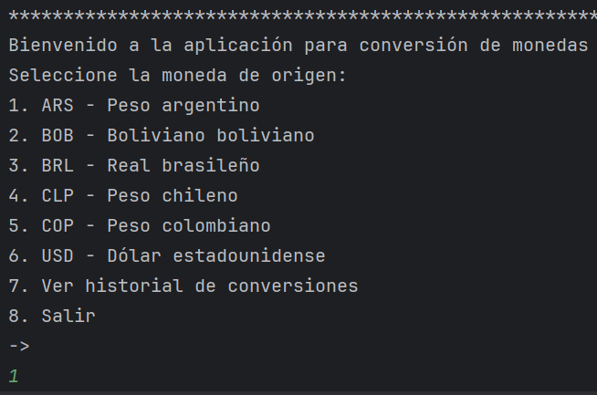
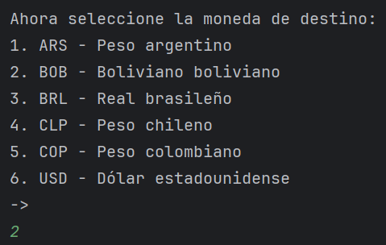
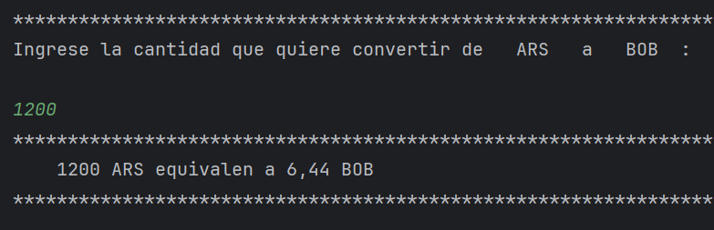
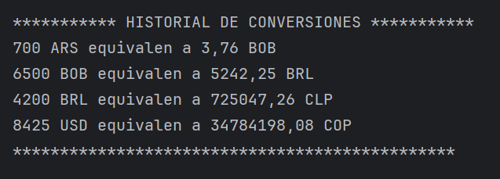

# Challenge: Conversor de Monedas

Este repositorio contiene una aplicación para convertir cantidades entre diferentes monedas. El objetivo principal es facilitar la conversión de divisas de manera rápida y precisa, mostrando el valor actualizado según tasas de cambio reales.

## Funcionalidades

- **Conversión entre monedas:** Permite seleccionar una moneda de origen y una moneda de destino para convertir cualquier cantidad.
- **Actualización de tasas de cambio:** Obtiene las tasas de cambio en tiempo real desde una API externa.
- **Interfaz intuitiva:** Ofrece una interfaz sencilla y fácil de usar para realizar las conversiones.
- **Historial de conversiones:** Guarda un historial de las conversiones realizadas para consulta posterior.
- **Validación de datos:** Verifica que los datos introducidos por el usuario sean válidos (números positivos, selección de monedas, etc.).
- **Soporte para múltiples monedas:** Incluye las principales monedas internacionales (USD, EUR, GBP, etc.) y puede ampliarse fácilmente para soportar otras divisas.
- **Notificación de errores:** Informa al usuario si ocurre algún error, como problemas de conexión o datos incorrectos.

## Instalación

1. Clona el repositorio:
   ```bash
   git clone https://github.com/CarlosGomezMartinez88/challenge-conversor-monedas.git
   ```
## Uso

1. Inicia la aplicación según la tecnología implementada (Run a la clase ConversorApp o Mayus + F10).
2. Selecciona la moneda de origen y la moneda de destino.

 

3. Introduce la cantidad que deseas convertir.



4. Visualiza el resultado y revisa el historial de conversiones si lo necesitas.



## Tecnologías utilizadas

- Java
- Postman
- GitHub

## Contribución

¡Las contribuciones son bienvenidas! Si deseas aportar mejoras, por favor abre un issue o envía un pull request.


**Autor:** Carlos Gómez Martínez
